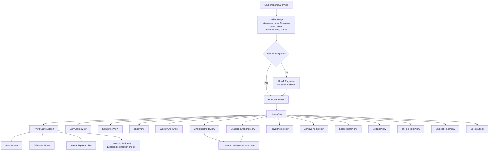
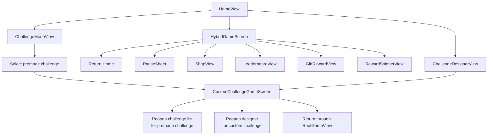

# Master App Map

This document is the canonical product and navigation map for the app as implemented in code today. If this report and the README disagree, the live SwiftUI entrypoints and presentation code win.

## 1. App Overview

### Canonical source of truth

- App boot and global dependency wiring: `2244/game2244/game2244App.swift`
- Root flow switching and feature sheet orchestration: `Packages/GameUI/Sources/GameUI/RootGameView.swift`
- Primary home hub and most user-facing entry buttons: `Packages/GameUI/Sources/GameUI/Home/HomeView.swift`
- Primary gameplay: `Packages/GameUI/Sources/GameUI/HybridGameScreen.swift`
- Challenge gameplay: `Packages/GameUI/Sources/GameUI/Challenge/CustomChallengeGameScreen.swift`

### What counts as a "screen" in this report

- Any standalone surface that owns a `NavigationStack` or `NavigationView`
- Any dedicated full-screen gameplay surface
- Any `.sheet`, `.adaptiveSheet`, or `.fullScreenCover` content that behaves like its own user destination
- Embedded building blocks such as `BoardView`, `JourneyPanel`, `SimplifiedGlassBoardView`, `TileScrollerView`, and other reusable widgets are summarized inside parent screens instead of treated as top-level screens

### Status legend

- `live`: reachable through the current app boot path
- `partial`: reachable, but includes placeholder logic, synthetic data, deprecated APIs, or unfinished host wiring
- `alternate`: repo-present surface that still works as a standalone flow, but is not the canonical live route
- `legacy`: older or superseded surface kept in the repo for reference or compatibility

### Canonical boot chain

- `game2244App` boots the app, injects stores/services, paints the background, and presents `RootGameView`
- `RootGameView` switches between `HomeView`, `HybridGameScreen`, and `CustomChallengeGameScreen`
- `HowToPlayView` is presented as a first-launch full-screen tutorial gate
- `HomeView` is the main app hub for play, progression, monetization, social, customization, and settings

## 2. Global Capability Matrix

| Product area | What the app can do | Primary entrypoints |
| --- | --- | --- |
| Core gameplay and scoring | Start or resume a run, build chains, merge tiles, score, detect game over, autosave progress | `HomeView`, `HybridGameScreen`, `GameView` |
| Power-ups and recovery | Use hammer, swap, magnet, undo, low-move recovery, out-of-moves recovery, challenge recovery | `HybridGameScreen`, `CustomChallengeGameScreen`, `BoostsSheet` |
| Tile journey and milestones | Track highest tile, render the milestone road, claim journey rewards, unlock tiles, update spawn pools | `HomeView`, `JourneyPanel`, `GiftRewardView`, unlock notification sheets |
| Daily rewards, streaks, and quests | Claim daily rewards, catch up claims, track streak milestones, complete daily quests | `DailyClaimsView`, `DailyStreaksView`, `DailyQuestsView`, `AchievementsView` |
| Achievements and tiering | View achievement progress, claim rewards, claim all, inspect tier ladders | `AchievementsView`, `AllTiersView` |
| Challenges and custom challenges | Play premade challenges, unlock on timeline, replay completed ones, design custom challenges, run sandboxed challenge games | `ChallengeModeView`, `ChallengeDesignerView`, `CustomChallengeGameScreen` |
| Leaderboard, reporting, and bans | View milestone leaderboard, top 150, history feed, report players, issue warnings/bans, track rank progress | `LeaderboardView`, `PlayerHistoryView`, `ReportPlayerSheet` |
| Profile and social identity | View profile stats, choose avatar, rename, pick country, compare profiles, share profile data | `PlayerProfileView`, `AvatarCustomizeView`, `RenameSheet`, `CompareView`, `CountryPickerView` |
| Shop, gems, offers, perks, remove ads | Buy bundles and gems, see weekly offer, buy boosts, restore purchases, remove ads | `ShopView`, `WeeklyOfferSheet`, `BoostsSheet`, `SettingsView`, legacy `StoreView` |
| Theme, wallpaper, music, and UI customization | Change tile themes, backgrounds, wallpapers, play button colors, and music themes | `ThemePickerView`, `MusicThemesView`, `PauseSheet` |
| Settings, support, accessibility | Control audio, haptics, reduced motion, hints, analytics, Game Center, report flow, support links | `SettingsView`, `HowToPlayView`, `TilesInfoView`, `PerksInfoView`, `ValidMovesInfoView` |
| Game Center, Firebase, syncing, ads | Authenticate Game Center, initialize Firebase, sync gems, watch rewarded ads, restore progress | `game2244App`, `SettingsView`, `LeaderboardView`, `HomeView`, `RootGameView` |

## 3. Launch / Root Navigation Map

### Gameplay and challenge branching

## 4. Pathways By User Journey

### First launch and onboarding

1. `game2244App` initializes global stores and services.
2. On non-debug first launch, `HowToPlayView` appears as a full-screen tutorial.
3. Completing or skipping the tutorial returns the user to `RootGameView`.
4. `RootGameView` shows `HomeView`, which becomes the long-term hub for all major app areas.

### Regular play loop

1. User enters `HomeView`.
2. Tapping `Play` opens `HybridGameScreen`.
3. During play, the user can pause, use power-ups, open the shop, view the leaderboard, receive gifts, or trigger milestone/unlock surfaces.
4. Dismissing gameplay returns to `HomeView`, which refreshes progress and badges.

### Daily progression loop

1. User opens `DailyClaimsView` from the left rail.
2. From daily rewards, the user can inspect reward icons and navigate streak-related progression.
3. `DailyStreaksView` exposes milestone rewards and detail sheets.
4. `AchievementsView` also contains a daily quest tab, and `DailyQuestsView` exists as a standalone screen for quest-only viewing.

### Challenge loop

1. User opens `ChallengeModeView` to browse timed or gated premade challenges.
2. Selecting a playable challenge launches `CustomChallengeGameScreen` with a premade config.
3. User can alternatively open `ChallengeDesignerView`, build a custom config, and launch the same dedicated challenge game screen.
4. Finishing a challenge returns the user either to the challenge list or back to the designer, depending on how the challenge was entered.

### Economy and customization loop

1. `HomeView` routes to `ShopView`, `WeeklyOfferSheet`, `SpinWheelView`, `BoostsSheet`, `ThemePickerView`, and `MusicThemesView`.
2. `SettingsView` also supports remove ads, restore purchases, Game Center, support, reporting, and quality-of-life toggles.
3. `PauseSheet` offers in-run accessibility and theme changes without leaving gameplay.

### Social, identity, and moderation loop

1. `HomeView` opens `PlayerProfileView`, `AchievementsView`, `LeaderboardView`, and `SettingsView`.
2. `PlayerProfileView` expands into avatar customization, rename, compare, country selection, and season history.
3. `LeaderboardView` expands into a history feed and report/banning logic.
4. `SettingsView` offers a separate `ReportPlayerSheet` flow that routes through support email and local evaluation logic.

## 5. Screen Inventory

### Root and hub surfaces

#### `game2244App`

- MainView: `game2244App`
- Type: `root`
- Entry From: App launch
- Purpose: Bootstraps the entire app, injects all major state/services, configures navigation appearance, and gates first-launch tutorial presentation
- Main Components: background theme layer, `RootGameView`, tutorial full-screen cover, store/service environment injection, Firebase/Game Center/audio/achievement/daily bootstrap tasks
- Primary Actions: initialize app services, load progress, attach wallet sync, authenticate services, show tutorial when needed
- Outbound Pathways: `RootGameView`, `HowToPlayView`
- State / Services: `GameStore`, `HomeState`, `PurchaseService`, ad/audio/haptics services, `AchievementStore`, `DailyClaimsStore`, `DailyQuestStore`, `ChallengeStore`, `SpinWheelState`, Firebase, Game Center
- Status: `live`

#### `RootGameView`

- MainView: `RootGameView`
- Type: `root`
- Entry From: `game2244App`
- Purpose: Owns the app's top-level state machine between home, standard gameplay, and dedicated challenge gameplay
- Main Components: home branch, regular play branch, custom challenge branch, adaptive sheets for daily claims, streaks, free spin, shop, challenge mode, and challenge designer
- Primary Actions: switch to gameplay, switch to custom challenge gameplay, reload progress when home appears, reopen challenge screens after challenge completion
- Outbound Pathways: `HomeView`, `HybridGameScreen`, `CustomChallengeGameScreen`, `DailyClaimsView`, `DailyStreaksView`, `SpinWheelView`, `ShopView`, `ChallengeModeView`, `ChallengeDesignerView`
- State / Services: `HomeState`, `GameStore`, `DailyClaimsStore`, `DailyQuestStore`, `WheelEngine`, `ChallengeStore`, `ChallengeDesignerStore`, `ProgressSyncCoordinator`
- Status: `live`

#### `HomeView`

- MainView: `HomeView`
- Type: `screen`
- Entry From: `RootGameView`
- Purpose: Main home hub for almost every major user journey in the app
- Main Components: `HomeBackgroundLayer`, `JourneyPanel`, `HUDTopBar`, left feature rail, right feature rail, main `Play` button, bottom dock, toast overlay, alert stack
- Primary Actions: start or resume play, open daily rewards, free spin, shop, music, boosts, challenge mode, challenge designer, weekly offer, theme picker, profile, achievements, leaderboard, settings, ad reward flow
- Outbound Pathways: `HybridGameScreen`, `DailyClaimsView`, `SpinWheelView`, `ShopView`, `MusicThemesView`, `BoostsSheet`, `WeeklyOfferSheet`, `ChallengeModeView`, `ChallengeDesignerView`, `PlayerProfileView`, `AchievementsView`, `LeaderboardView`, `SettingsView`, `ThemePickerView`
- State / Services: `HomeState`, `DailyClaimsStore`, `AchievementStore`, `ToastManager`, `SpinWheelState`, `LeaderboardClient`, background theme registry, `HomeActions`
- Status: `live`

#### `HowToPlayView`

- MainView: `HowToPlayView`
- Type: `full-screen`
- Entry From: `game2244App` first-launch tutorial gate, `SettingsView`
- Purpose: Teach the rules, chain-building logic, eight-direction movement, merge scoring, power-ups, and valid-move concepts
- Main Components: header with skip, paged tutorial deck, page dots, back/next CTA row, multiple interactive demo pages
- Primary Actions: move between pages, skip tutorial, finish tutorial
- Outbound Pathways: back to `game2244App` / `RootGameView`, dismissal from `SettingsView`
- State / Services: local page state, optional completion callback
- Status: `live`

### Gameplay, challenge, and moment-to-moment reward surfaces

#### `HybridGameScreen`

- MainView: `HybridGameScreen`
- Type: `full-screen`
- Entry From: `RootGameView`, alternate `GameView`
- Purpose: Primary gameplay screen for the normal endless run
- Main Components: top HUD, `MilestoneProgressBar`, main board view, compact/regular power-up docks, shop button, overlays for top merge tile and game over, power-up modes, milestone alerts, multiple sheet destinations
- Primary Actions: play the board, use hammer/swap/magnet/undo, open pause, shop, leaderboard, claim gifts, trigger unlock reward spinner, dismiss back home
- Outbound Pathways: `PauseSheet`, `ShopView`, `LeaderboardView`, `GiftRewardView`, `RewardSpinnerView`, unlock notification sheet views, back to `HomeView`
- State / Services: `GameStore`, ad service, haptics, Game Center, leaderboard client, theme, scene phase, size class
- Status: `live`

#### `PauseSheet`

- MainView: `PauseSheet`
- Type: `sheet`
- Entry From: `HybridGameScreen`
- Purpose: In-run pause and quick settings surface
- Main Components: resume/restart actions, accessibility toggle, tile theme picker, background theme picker
- Primary Actions: resume, restart, change color blind mode, change tile/background themes
- Outbound Pathways: back to `HybridGameScreen`
- State / Services: `GameStore`, color blind setting, selected tile/background theme `AppStorage`
- Status: `live`

#### `GiftRewardView`

- MainView: `GiftRewardView`
- Type: `sheet`
- Entry From: `HybridGameScreen`
- Purpose: Celebrate and explain gift rewards granted by gameplay systems such as glass-shatter gifts
- Main Components: animated reward card, mascot/pet illustration, reward item list, CTA button
- Primary Actions: review reward contents and dismiss / claim
- Outbound Pathways: back to `HybridGameScreen`
- State / Services: `GiftReward` payload, local animation state
- Status: `live`

#### `RewardSpinnerView`

- MainView: `RewardSpinnerView`
- Type: `sheet`
- Entry From: `HybridGameScreen`
- Purpose: Resolve unlock reward multipliers for milestone-based rewards
- Main Components: reward spinner, multiplier selection logic, close action
- Primary Actions: spin / resolve unlock reward, dismiss
- Outbound Pathways: back to `HybridGameScreen`
- State / Services: base amount, unlocked tile value, reward-resolution callback
- Status: `live`

#### `UnlockedNotificationView` / `AddedNotificationView` / `ExcludedNotificationView`

- MainView: `UnlockedNotificationView`, `AddedNotificationView`, `ExcludedNotificationView`
- Type: `modal`
- Entry From: `HybridGameScreen` notification sheet
- Purpose: Explain milestone progression changes such as a newly unlocked tile, an added spawn tile, or an eliminated tile
- Main Components: themed reward card layouts, journey tile previews, explanatory text, dismiss CTA
- Primary Actions: read progression change and close the modal
- Outbound Pathways: back to `HybridGameScreen`
- State / Services: `GameStore` notification payload, current theme
- Status: `live`

#### `CustomChallengeGameScreen`

- MainView: `CustomChallengeGameScreen`
- Type: `full-screen`
- Entry From: `ChallengeModeView`, `ChallengeDesignerView`, `RootGameView`
- Purpose: Dedicated gameplay screen for challenge sessions that run in a sandboxed `GameStore`
- Main Components: challenge header with timer and target, power-up dock, `SimplifiedGlassBoardView`, result overlay, power-up recovery overlay, time recovery overlay
- Primary Actions: play timed challenge, spend gems on recovery/power-ups, finish or fail challenge, dismiss back into root challenge flow
- Outbound Pathways: challenge list reopen, designer reopen, return to root/home state
- State / Services: sandboxed `GameStore`, main `GameStore` for achievement tracking, `HomeState`, haptics, `ChallengeStore`
- Status: `live`

#### `ChallengeModeView`

- MainView: `ChallengeModeView`
- Type: `sheet`
- Entry From: `HomeView`, `RootGameView`
- Purpose: Show the premade challenge timeline, lock state, countdowns, and play/replay entry
- Main Components: timeline spine, challenge cards, selected challenge state, play button footer, reward icon legend sheet
- Primary Actions: browse timeline, select a playable challenge, open legend, launch a challenge
- Outbound Pathways: `CustomChallengeGameScreen`, `IconLegendSheet`, dismiss to `HomeView`
- State / Services: `ChallengeStore`, `HomeState`, timer-driven countdown state
- Status: `live`

#### `IconLegendSheet`

- MainView: `IconLegendSheet`
- Type: `sheet`
- Entry From: `ChallengeModeView`
- Purpose: Explain icons used in challenge rewards and statuses
- Main Components: legend list, reward/icon descriptions, dismiss control
- Primary Actions: review legend and dismiss
- Outbound Pathways: back to `ChallengeModeView`
- State / Services: local legend item definitions
- Status: `live`

#### `ChallengeDesignerView`

- MainView: `ChallengeDesignerView`
- Type: `sheet`
- Entry From: `HomeView`, `RootGameView`
- Purpose: Let the player build a custom challenge configuration before starting a dedicated challenge session
- Main Components: target carousel, time/min-tile/levels steppers, tile candidate columns, predicted reward card, bottom play bar
- Primary Actions: change target, tune challenge parameters, inspect candidate tiles, launch custom challenge
- Outbound Pathways: `CustomChallengeGameScreen`, dismiss to `HomeView`
- State / Services: `ChallengeDesignerStore`, current theme, dismiss callback
- Status: `live`

### Progression, daily systems, and reward surfaces

#### `DailyClaimsView`

- MainView: `DailyClaimsView`
- Type: `sheet`
- Entry From: `HomeView`, `RootGameView`
- Purpose: Main daily rewards surface for claiming today's reward, catch-up claims, and browsing long-term reward calendars
- Main Components: streak header, availability section, claim actions, weekly/yearly pager, icon legend sheet, claim animation overlay
- Primary Actions: claim today, claim catch-up rewards, browse pages, open reward icon legend
- Outbound Pathways: `IconLegendView`, dismiss to `HomeView`
- State / Services: `DailyClaimsStore`, `GameStore`, `HomeState`, audio service
- Status: `live`

#### `IconLegendView`

- MainView: `IconLegendView`
- Type: `sheet`
- Entry From: `DailyClaimsView`
- Purpose: Explain the icon set used in the daily rewards UI
- Main Components: reward icon rows, navigation title, done button
- Primary Actions: review icon meanings and dismiss
- Outbound Pathways: back to `DailyClaimsView`
- State / Services: local reward-kind legend
- Status: `live`

#### `DailyStreaksView`

- MainView: `DailyStreaksView`
- Type: `sheet`
- Entry From: `RootGameView`
- Purpose: Visualize the current daily streak and long-term streak milestones
- Main Components: current streak hero, progress section, milestone cards, milestone grid, `StreakDetailSheet`
- Primary Actions: review streak progress, tap milestone rewards for details
- Outbound Pathways: `StreakDetailSheet`, dismiss to `HomeView`
- State / Services: `DailyClaimsStore`
- Status: `live`

#### `StreakDetailSheet`

- MainView: `StreakDetailSheet`
- Type: `sheet`
- Entry From: `DailyStreaksView`
- Purpose: Show a single daily streak milestone and its reward breakdown
- Main Components: milestone hero, unlocked state, reward rows, dismiss button
- Primary Actions: inspect the milestone and dismiss
- Outbound Pathways: back to `DailyStreaksView`
- State / Services: one `DailyStreak` payload
- Status: `live`

#### `DailyQuestsView`

- MainView: `DailyQuestsView`
- Type: `screen`
- Entry From: standalone quest route, functionally mirrored inside `AchievementsView`
- Purpose: Show daily quests, reset countdown, progress bars, and claim actions in a quest-only layout
- Main Components: reset countdown chip, quest cards, milestone progress bar for tile quests, claim buttons
- Primary Actions: inspect quest progress, claim completed quest rewards
- Outbound Pathways: dismiss
- State / Services: `DailyQuestStore`, `HomeState`
- Status: `live`

#### `AchievementsView`

- MainView: `AchievementsView`
- Type: `sheet`
- Entry From: `HomeView`
- Purpose: Combined progression surface for achievements and daily quests
- Main Components: segmented tab picker, claim-all button, achievement rows, daily quest section, all-tiers sheet
- Primary Actions: claim individual achievements, claim all, switch tabs, open tier ladders
- Outbound Pathways: `AllTiersView`, dismiss to `HomeView`
- State / Services: `AchievementStore`, `DailyQuestStore`, `HomeState`, `GameStore`
- Status: `live`

#### `AllTiersView`

- MainView: `AllTiersView`
- Type: `sheet`
- Entry From: `AchievementsView`
- Purpose: Show every tier in a progressive achievement and scroll to the current tier
- Main Components: tier row list, status icons, reward summaries, auto-scroll to current tier
- Primary Actions: review tier ladder and dismiss
- Outbound Pathways: back to `AchievementsView`
- State / Services: tier entries from `AchievementStore`
- Status: `live`

#### `SpinWheelView`

- MainView: `SpinWheelView`
- Type: `sheet`
- Entry From: `HomeView`, `RootGameView`
- Purpose: Free-spin and bonus-spin reward surface with multiplier inventory and gem-purchase shortcuts
- Main Components: custom wheel, availability card, purchase buttons, spin CTA, multiplier inventory card, shop redirect
- Primary Actions: spin, buy bonus spins, open gem shop, collect rewards
- Outbound Pathways: `ShopView`, dismiss to `HomeView`
- State / Services: `WheelEngine`, `GameStore`, `SpinWheelState`, `HomeState`, haptics, audio
- Status: `live`

#### `BoostsSheet`

- MainView: `BoostsSheet`
- Type: `sheet`
- Entry From: `HomeView`
- Purpose: Sell and manage timed score boosts, power-up discounts, and achievement boosts
- Main Components: three purchase sections, active/queued countdowns, gem cost badges, toast feedback
- Primary Actions: buy boosts, extend active boosts, dismiss after purchase
- Outbound Pathways: back to `HomeView`
- State / Services: `GameStore`, `ToastManager`
- Status: `live`

### Shop, offer, and customization surfaces

#### `ShopView`

- MainView: `ShopView`
- Type: `sheet`
- Entry From: `HomeView`, `HybridGameScreen`, `SpinWheelView`, `RootGameView`
- Purpose: Main monetization storefront for bundles, gem packs, and perks
- Main Components: tab selector (`Bundles`, `Gems`, `Perks`), bundle cards, purchase overlays, featured offer placement, gem balance
- Primary Actions: browse tabs, buy bundles, buy gems, buy perks
- Outbound Pathways: dismiss to parent screen
- State / Services: `ShopStore`
- Status: `live`

#### `WeeklyOfferSheet`

- MainView: `WeeklyOfferSheet`
- Type: `sheet`
- Entry From: `HomeView`
- Purpose: Sell the currently active limited-time best offer
- Main Components: countdown header, offer contents list, purchase CTA, loading overlay
- Primary Actions: inspect contents, buy the limited-time offer
- Outbound Pathways: dismiss to `HomeView`
- State / Services: `ShopStore`, `WeeklyOfferManager`
- Status: `live`

#### `ThemePickerView`

- MainView: `ThemePickerView`
- Type: `sheet`
- Entry From: `HomeView`
- Purpose: Central customization surface for tile themes, backgrounds, wallpapers, and play button colors
- Main Components: segmented picker, tile theme cards, background category sections, wallpaper grid, play button color grid
- Primary Actions: change visual theme settings
- Outbound Pathways: dismiss to `HomeView`
- State / Services: multiple `AppStorage` keys, theme/background/wallpaper registries
- Status: `live`

#### `MusicThemesView`

- MainView: `MusicThemesView`
- Type: `sheet`
- Entry From: `HomeView`
- Purpose: Let the player preview and select music themes/instruments
- Main Components: title/header, horizontal pager, instrument artwork, preview playback logic, select button
- Primary Actions: page through instruments, preview sound, select current music theme
- Outbound Pathways: dismiss to `HomeView`
- State / Services: audio service, `currentMusicTheme` `AppStorage`, placeholder try/purchase callbacks
- Status: `partial`

### Social, identity, and moderation surfaces

#### `LeaderboardView`

- MainView: `LeaderboardView`
- Type: `sheet`
- Entry From: `HomeView`, `HybridGameScreen`
- Purpose: Show milestone and top-150 leaderboard views plus moderation/reporting affordances
- Main Components: custom nav bar, filter tabs, milestone view, top-150 mode, player history full-screen cover, reporting alerts, ban/report-abuse logic
- Primary Actions: switch filters, inspect own rank, open history, report players, refresh and submit score
- Outbound Pathways: `PlayerHistoryView`, dismiss to parent screen
- State / Services: `LeaderboardModel`, `LeaderboardClient`, `GameStore`, `HomeState`, current theme
- Status: `partial`

#### `PlayerHistoryView`

- MainView: `PlayerHistoryView`
- Type: `full-screen`
- Entry From: `LeaderboardView`
- Purpose: Show a chronological activity feed for leaderboard-related events
- Main Components: custom header, event feed rows, synthetic event generation based on leaderboard entries
- Primary Actions: inspect event history and dismiss
- Outbound Pathways: back to `LeaderboardView`
- State / Services: leaderboard entries, generated mock history events
- Status: `partial`

#### `PlayerProfileView`

- MainView: `PlayerProfileView`
- Type: `sheet`
- Entry From: `HomeView`
- Purpose: Central player identity surface for profile, stats, mastery, and social entrypoints
- Main Components: identity hero, core stats, global rank card, mastery grid, sync footer, toolbar gem pill
- Primary Actions: refresh profile, customize avatar, compare profiles, rename player, choose country
- Outbound Pathways: `AvatarCustomizeView`, `CompareView`, `RenameSheet`, `CountryPickerView`
- State / Services: `ProfileModel`, `ProfileClient`, `GameStore`
- Status: `live`

#### `RenameSheet`

- MainView: `RenameSheet`
- Type: `sheet`
- Entry From: `PlayerProfileView`
- Purpose: Edit the player display name
- Main Components: single text field form, save/cancel actions, failure message
- Primary Actions: enter a new name and save
- Outbound Pathways: back to `PlayerProfileView`
- State / Services: async save callback from `ProfileModel`
- Status: `live`

#### `AvatarCustomizeView`

- MainView: `AvatarCustomizeView`
- Type: `sheet`
- Entry From: `PlayerProfileView`
- Purpose: Pick a cosmetic avatar
- Main Components: avatar grid, selection state, done button, avatar preview badges
- Primary Actions: select avatar and dismiss
- Outbound Pathways: back to `PlayerProfileView`
- State / Services: `AvatarCatalog`
- Status: `live`

#### `SeasonHistoryView`

- MainView: `SeasonHistoryView`
- Type: `sheet`
- Entry From: profile-related flow
- Purpose: Show current season data and prior season summaries
- Main Components: current season section, past season list
- Primary Actions: review season history and close
- Outbound Pathways: back to profile flow
- State / Services: `SeasonInfo`, synthetic/randomized past season labels
- Status: `partial`

#### `CompareView`

- MainView: `CompareView`
- Type: `sheet`
- Entry From: `PlayerProfileView`
- Purpose: Compare the local player profile against selected other profiles
- Main Components: search/filter UI, selected player list, mini comparison leaderboard, shareable identity data
- Primary Actions: search players, add/remove comparisons, inspect comparative standings
- Outbound Pathways: back to `PlayerProfileView`
- State / Services: `CompareProfile`, locally generated `MockPlayer` data, saved selections in `UserDefaults`
- Status: `partial`

#### `CountryPickerView`

- MainView: `CountryPickerView`
- Type: `full-screen`
- Entry From: `PlayerProfileView`
- Purpose: Choose the player's country flag and country metadata
- Main Components: country list, current selection, selection callback
- Primary Actions: choose a country
- Outbound Pathways: back to `PlayerProfileView`
- State / Services: `ProfileModel` country update callback
- Status: `live`

#### `SettingsView`

- MainView: `SettingsView`
- Type: `sheet`
- Entry From: `HomeView`
- Purpose: Central app settings, support, privacy, Game Center, and purchase surface
- Main Components: form sections for audio/haptics, accessibility/gameplay, purchases, Game Center, privacy, support, version info
- Primary Actions: change settings, restore purchases, open Game Center, open support mail, report players, rate app, open info/reference sheets
- Outbound Pathways: `HowToPlayView`, `TilesInfoView`, `PerksInfoView`, `ValidMovesInfoView`, `GameCenterView`, `ReportPlayerSheet`
- State / Services: audio service, haptics, purchase service, `HomeState`, `UserDefaults`, Game Center
- Status: `live`

#### `GameCenterView`

- MainView: `GameCenterView`
- Type: `sheet`
- Entry From: `SettingsView`
- Purpose: Wrap Apple's Game Center dashboard in a SwiftUI-presented surface
- Main Components: `GKGameCenterViewController` wrapper and coordinator
- Primary Actions: inspect Game Center dashboard and dismiss
- Outbound Pathways: back to `SettingsView`
- State / Services: GameKit
- Status: `partial`

#### `ReportPlayerSheet`

- MainView: `ReportPlayerSheet`
- Type: `sheet`
- Entry From: `SettingsView`
- Purpose: Collect a player report and route it to email/support plus local report-evaluation logic
- Main Components: player info form, reason picker, details field, confirm alert
- Primary Actions: fill report, confirm report, open support email draft
- Outbound Pathways: dismiss to `SettingsView`
- State / Services: `HomeState`, `totalUniqueReports` `AppStorage`, local random evaluation logic
- Status: `partial`

### Reference and explainer surfaces

#### `TilesInfoView`

- MainView: `TilesInfoView`
- Type: `sheet`
- Entry From: `SettingsView`
- Purpose: Explain merge rules, tile growth, infinity goal, and tile abbreviations
- Main Components: bullet-point rules, themed tile examples, infinity visual, abbreviations navigation button
- Primary Actions: review rules, open abbreviation reference
- Outbound Pathways: `AbbreviationsListView`, dismiss to `SettingsView`
- State / Services: current theme
- Status: `live`

#### `AbbreviationsListView`

- MainView: `AbbreviationsListView`
- Type: `screen`
- Entry From: `TilesInfoView`
- Purpose: Show the game's tile abbreviation ladder from `K` through higher suffixes plus infinity
- Main Components: colored tile rows, abbreviation/sample mapping, infinity row
- Primary Actions: review tile abbreviation meanings
- Outbound Pathways: back to `TilesInfoView`
- State / Services: current theme, `TileStepLabelFormatter`
- Status: `live`

#### `PerksInfoView`

- MainView: `PerksInfoView`
- Type: `sheet`
- Entry From: `SettingsView`
- Purpose: Explain the app's major perk/power-up categories
- Main Components: three perk rows for hammer, swap, and merge-all behavior
- Primary Actions: review perk descriptions and dismiss
- Outbound Pathways: back to `SettingsView`
- State / Services: local view data only
- Status: `live`

#### `ValidMovesInfoView`

- MainView: `ValidMovesInfoView`
- Type: `sheet`
- Entry From: `SettingsView`
- Purpose: Explain valid move counts, color coding, low-move warnings, and out-of-moves recovery behavior
- Main Components: bullet-point guide, color key rows, alert previews, gameplay tip card
- Primary Actions: review move-state explanations and dismiss
- Outbound Pathways: back to `SettingsView`
- State / Services: local explainer data only
- Status: `live`

## 6. Legacy / Alternate Surfaces Appendix

These surfaces still exist in the repo and are screen-like, but they are not part of the canonical boot path through `game2244App -> RootGameView -> HomeView`.

#### `HomeScreen`

- MainView: `HomeScreen`
- Type: `alternate`
- Entry From: repo-only standalone surface
- Purpose: Older home implementation with a simpler journey-first layout
- Main Components: highest tile hero, `JourneyPanel`, `PlayButton`, `AllBlocksView`, `CreateChallengeSheet`, local challenge sheet launch
- Primary Actions: play, view all blocks, create challenge
- Outbound Pathways: `AllBlocksView`, `CreateChallengeSheet`, `HybridGameScreen`
- State / Services: `GameStore`, storage, tile journey
- Status: `alternate`

#### `AllBlocksView`

- MainView: `AllBlocksView`
- Type: `legacy`
- Entry From: `HomeScreen`
- Purpose: Full-journey modal that exposes the entire block road in a dedicated navigation shell
- Main Components: `JourneyPanel`, close button
- Primary Actions: browse full journey and close
- Outbound Pathways: back to `HomeScreen`
- State / Services: tile journey
- Status: `legacy`

#### `CreateChallengeSheet`

- MainView: `CreateChallengeSheet`
- Type: `legacy`
- Entry From: `HomeScreen`
- Purpose: Older inline custom challenge builder predating `ChallengeDesignerView`
- Main Components: target row, steppers, tile columns, reward row, play button
- Primary Actions: design a challenge and launch gameplay
- Outbound Pathways: `HybridGameScreen`
- State / Services: local settings, `GameStore`
- Status: `legacy`

#### `GameView`

- MainView: `GameView`
- Type: `alternate`
- Entry From: repo-only standalone app/game wrapper
- Purpose: Thin wrapper around `HybridGameScreen` with autosave, scene phase saving, Game Center score submission, and game-over alerts
- Main Components: `HybridGameScreen`, autosave handlers, scene phase observer, score submission helper, game-over alert
- Primary Actions: play the normal game through a direct wrapper
- Outbound Pathways: `HybridGameScreen`
- State / Services: `GameStore`, purchase service, ad service, storage, Game Center, scene phase
- Status: `alternate`

#### `StoreView`

- MainView: `StoreView`
- Type: `legacy`
- Entry From: repo-only standalone surface
- Purpose: Older simplified gem-pack and ad-free store screen
- Main Components: gem pack list, ad-free section, restore button
- Primary Actions: buy packs, restore purchases, close
- Outbound Pathways: dismiss
- State / Services: `GameStore`, purchase service
- Status: `legacy`

#### `GlassGameView`

- MainView: `GlassGameView` in `Packages/GlassPreview`
- Type: `legacy`
- Entry From: preview/demo package, not the shipping app route
- Purpose: Preview-only experimental glass gameplay presentation
- Main Components: glass-preview game shell
- Primary Actions: preview visual treatment
- Outbound Pathways: none in the shipping app
- State / Services: preview/demo store setup
- Status: `legacy`

## 7. Known Gaps / TODO / Partial Wiring

- `game2244App` injects `leaderboardClient` as `.noop`, even though Firebase/Game Center leaderboard-related code exists elsewhere in the repo. The leaderboard UI is rich, but the default runtime client is not clearly wired to a live backend.
- `RootGameView` still contains TODO host handlers for `openProfile`, `openAchievements`, `openLeaderboard`, `openSettings`, theme actions, and `openSaleOffer`. Most of these are bypassed by `HomeView`'s own sheet state, but the `SALE OFFER` left-rail button still routes through the unfinished `openSaleOffer` action.
- `MusicThemesView` is reachable and can select the current music theme, but the host closures used from `HomeView` are still placeholder `print` hooks for try/purchase behavior.
- `ProgressSyncCoordinator` is instantiated with `remoteStore: nil`, so remote progress sync is explicitly unfinished at the root level.
- `GameCenterView` wraps `GKGameCenterViewController`, which is deprecated relative to the repo's Apple-platform baseline.
- `ReportPlayerSheet` uses local/randomized evaluation helpers plus a `mailto:` handoff rather than a real moderation backend.
- `PlayerHistoryView` generates synthetic event history from leaderboard entries instead of showing a persisted server-backed moderation feed.
- `SeasonHistoryView` and large parts of `CompareView` are synthetic/mock-driven rather than clearly tied to live profile services.
- `StoreView` buys gem packs by directly adding currency in code, which strongly suggests it is an obsolete placeholder store rather than production commerce UI.
- The first-launch tutorial gate only auto-presents in non-debug builds because it is wrapped in `#if !DEBUG`.
- `useGlassPreview` is stored in app state, but the canonical boot path always renders `RootGameView`; the flag does not currently switch the user into a glass-preview route.

## Notes

- This report intentionally focuses on user destinations and navigation surfaces.
- Reusable components such as `JourneyPanel`, `HUDTopBar`, `BoardView`, `TileScrollerView`, `SimplifiedGlassBoardView`, and preview helpers are documented under their parent screens instead of treated as standalone destinations.
