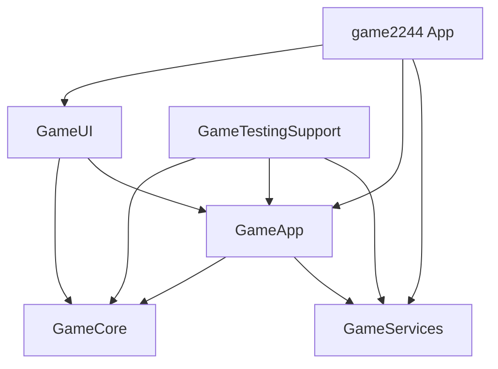

# Ultimate2244 - iOS Game

A modern implementation of the 2244 puzzle game for iOS 18+, built with Swift 6, SwiftUI, and modular architecture.

## 🎮 Game Overview

2244 is a puzzle game where players connect adjacent tiles with equal values to create chains. The first two tiles must be equal, and subsequent tiles must be either equal or double the previous value. When a valid chain is completed, tiles merge into double the maximum value in the chain.

## 🏗 Architecture

### Module Structure

```
2244/
├── game2244.xcworkspace      # Main workspace
├── 2244/
│   ├── game2244.xcodeproj    # Active Xcode project
│   └── game2244/             # iOS app target
└── Packages/                  # Local Swift packages
    ├── GameCore/             # Game engine, logic, deterministic RNG
    ├── GameApp/              # Stores, state management, DI
    ├── GameUI/               # SwiftUI views, gestures, themes  
    ├── GameServices/         # StoreKit, ads, haptics, remote config
    └── GameTestingSupport/   # Test fixtures, mocks, snapshots
```

### Technology Stack

- **Swift 6** with strict concurrency
- **iOS 18+** minimum deployment
- **SwiftUI** with Observation framework (@Observable/@Bindable)
- **StoreKit 2** for in-app purchases
- **Dependency Injection** via @Environment
- **Deterministic RNG** for replay support

## 🛠 Build Instructions

### Prerequisites

- Xcode 16.0+
- iOS 18.0+ SDK
- Swift 6.0+

### Building the Project

```bash
# Build for iOS Simulator
FIREBASE_SOURCE_FIRESTORE=1 xcodebuild -workspace game2244.xcworkspace \
           -scheme game2244 \
           -configuration Debug \
           -sdk iphonesimulator \
           -quiet clean build

# Build for Device  
FIREBASE_SOURCE_FIRESTORE=1 xcodebuild -workspace game2244.xcworkspace \
           -scheme game2244 \
           -configuration Release \
           -sdk iphoneos \
           -quiet clean build
```

The committed Xcode and package lockfiles are resolved with `FIREBASE_SOURCE_FIRESTORE=1`.
Keep that environment variable when resolving packages, building archives, or
reproducing Xcode Cloud so Firebase uses the `grpc-ios` source-Firestore graph.

### Running Tests

```bash
# Run all tests
FIREBASE_SOURCE_FIRESTORE=1 xcodebuild test -workspace game2244.xcworkspace \
                -scheme game2244 \
                -destination 'platform=iOS Simulator,name=iPhone 16' \
                -quiet

# Run specific package tests
swift test --package-path Packages/GameCore
```

## 🎯 Development Roadmap

### ✅ M0: Bootstrap (Complete)
- [x] Workspace and module structure
- [x] Local SwiftPM packages
- [x] Dependency injection setup
- [x] Basic app scene

### 🚧 M1: Core Gameplay (In Progress)
- [x] Board representation and tiles
- [x] Chain validation logic
- [x] Merge mechanics and gravity
- [x] Drag gesture handling
- [ ] Polish animations and haptics

### 📋 M2: Monetization
- [ ] StoreKit 2 integration
- [ ] Ad service abstraction
- [ ] Coin economy
- [ ] Power-ups (hammer, swap, shuffle)

### 📋 M3: Theming & Accessibility
- [ ] Dynamic color themes
- [ ] Color-blind mode
- [ ] VoiceOver support
- [ ] Remote Config integration

### 📋 M4: Daily Mode & Replay
- [ ] Daily seed generation
- [ ] Replay recording/playback
- [ ] Share codes
- [ ] Leaderboards

## 🔑 Configuration

### Product IDs (Placeholder)
```swift
let adFreeProductID = "com.game2244.adfree"
```

### Remote Config Keys
- `theme.palette` - Color theme overrides
- `game.spawnWeights` - Tile spawn probabilities
- `ads.interstitialInterval` - Games between ads

## 🧪 Testing

The project uses Swift Testing framework (not XCTest):

```swift
import Testing

@Test
func testChainValidation() {
    let engine = GameEngine()
    // Test implementation
}
```

## 📦 Module Dependencies



## 🚀 Getting Started

1. Clone the repository
2. Open `game2244.xcworkspace` in Xcode
3. Select the `game2244` scheme
4. Build and run on iOS Simulator or device

## 📝 License

Copyright © 2025. All rights reserved.
