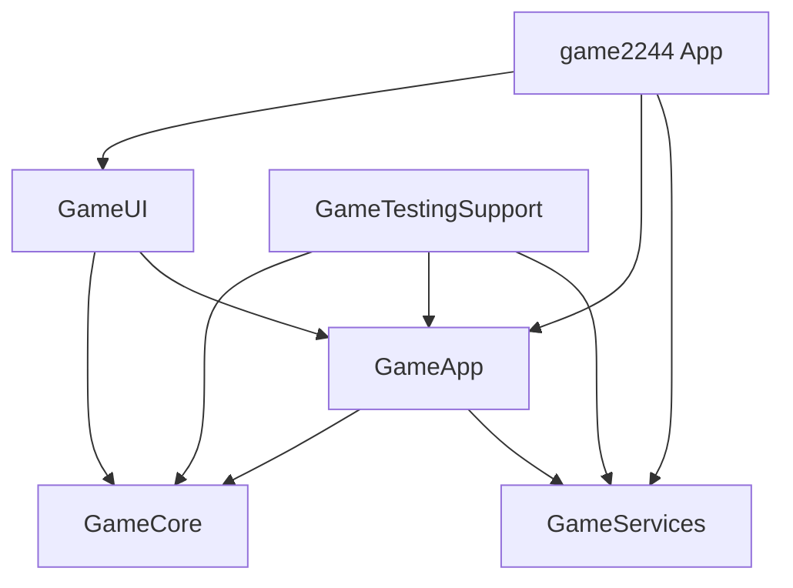

# Ultimate2244 - iOS Game

A modern implementation of the 2244 puzzle game for iOS 26+, built with Swift 6.2, SwiftUI, Firebase, StoreKit 2, AdMob, and modular local Swift packages.

## 🎮 Game Overview

2244 is a puzzle game where players connect adjacent tiles with equal values to create chains. The first two tiles must be equal, and subsequent tiles must be either equal or double the previous value. When a valid chain is completed, tiles merge into double the maximum value in the chain.

## 🏗 Architecture

### Module Structure

```
2244/
├── game2244.xcworkspace      # Main workspace
├── 2244/
│   ├── game2244.xcodeproj    # Active Xcode project
│   └── game2244/             # iOS app target
└── Packages/                  # Local Swift packages
    ├── GameCore/             # Game engine, logic, deterministic RNG
    ├── GameApp/              # Stores, state management, DI
    ├── GameUI/               # SwiftUI views, gestures, themes  
    ├── GameServices/         # StoreKit, ads, haptics, remote config
    └── GameTestingSupport/   # Test fixtures, mocks, snapshots
```

### Technology Stack

- **Swift 6.2** with strict concurrency
- **iOS 26+** minimum deployment
- **SwiftUI** with Observation framework (@Observable/@Bindable)
- **StoreKit 2** for in-app purchases
- **Firebase** for auth, Firestore progress/reporting, and Cloud Functions leaderboards
- **Google Mobile Ads / UMP** for ads and consent
- **Dependency Injection** via @Environment
- **Deterministic RNG** for replay support

## 🛠 Build Instructions

### Prerequisites

- Xcode 26+
- iOS 26 SDK
- Swift 6.2+

### Building the Project

```bash
# Build for iOS Simulator
FIREBASE_SOURCE_FIRESTORE=1 xcodebuild -workspace game2244.xcworkspace \
           -scheme game2244 \
           -configuration Debug \
           -sdk iphonesimulator \
           -onlyUsePackageVersionsFromResolvedFile \
           -quiet clean build

# Build for Device  
FIREBASE_SOURCE_FIRESTORE=1 xcodebuild -workspace game2244.xcworkspace \
           -scheme game2244 \
           -configuration Release \
           -sdk iphoneos \
           -onlyUsePackageVersionsFromResolvedFile \
           -quiet clean build
```

The committed app-project and package lockfiles are resolved with
`FIREBASE_SOURCE_FIRESTORE=1`. Keep that environment variable when resolving
packages, building archives, or reproducing Xcode Cloud so Firebase uses the
`grpc-ios` source-Firestore graph. Keep
`-onlyUsePackageVersionsFromResolvedFile` on local CLI builds so Xcode does not
rewrite the workspace lockfile back to Firebase's binary Firestore graph.
In Xcode Cloud, set `FIREBASE_SOURCE_FIRESTORE` to `1` in the workflow
Environment section. The repo's `ci_scripts/ci_pre_xcodebuild.sh` checks this
before the archive step so Cloud does not silently try to resolve
`abseil-cpp-binary` / `grpc-binary` against the committed source lockfiles.

### Running Tests

```bash
# Run all tests
FIREBASE_SOURCE_FIRESTORE=1 xcodebuild test -workspace game2244.xcworkspace \
                -scheme game2244 \
                -destination 'platform=iOS Simulator,name=iPhone 16' \
                -quiet

# Run specific package tests
swift test --package-path Packages/GameCore
```

## 🎯 Release Status

The app is past the initial roadmap milestones. Core gameplay, progression,
daily rewards, challenges, achievements, StoreKit catalog wiring, Firebase
leaderboard submission, reporting, AdMob integration, and launch-readiness
checks are implemented locally.

Before an App Store submission, use `Docs/ReleaseReadiness.md` as the source of
truth. The remaining work is mainly external validation: App Store Connect IAP
metadata and agreements, AdMob/UMP console setup, TestFlight sandbox purchases,
real-device Firebase smoke tests, and App Privacy completion.

## 🔑 Configuration

### Product IDs

The canonical StoreKit catalog is documented in `Docs/IAP_CATALOG.md` and
implemented in `Packages/GameCore/Sources/GameCore/Models/IAPProduct.swift`.
All 15 product IDs must exist in App Store Connect before submission.

### Firebase

Keep the real `GoogleService-Info.plist` local at
`2244/game2244/GoogleService-Info.plist`. It is intentionally ignored and must
not be committed. Deploy Firebase from the `firebase/` directory through the
scripts in `firebase/package.json`; there is no root-level Firebase deploy path.

## 🧪 Testing

The project uses Swift Testing framework (not XCTest):

```swift
import Testing

@Test
func testChainValidation() {
    let engine = GameEngine()
    // Test implementation
}
```

## 📦 Module Dependencies



## 🚀 Getting Started

1. Clone the repository
2. Open `game2244.xcworkspace` in Xcode
3. Select the `game2244` scheme
4. Build and run on iOS Simulator or device

## 📝 License

Copyright © 2025. All rights reserved.
